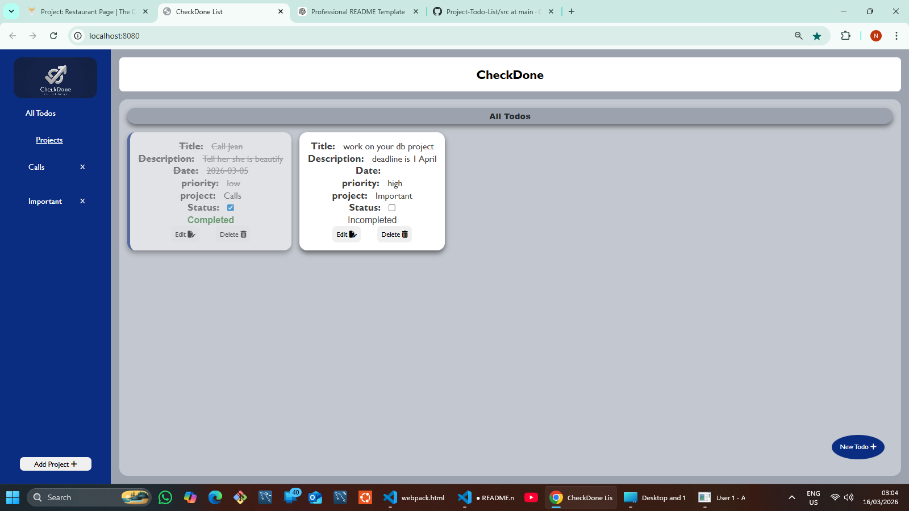

📝 To-Do List App

A modern To-Do List web application built as part of the Intermediate JavaScript section of The Odin Project curriculum.
The application allows users to create, organize, and manage their tasks efficiently with a clean and intuitive interface.

📸 Preview

click on this link for live preview: https://ofosunewton.github.io/Project-Todo-List/

✨ Features

✅ Create new tasks

📝 Add descriptions and additional details to tasks

📅 Organize tasks by projects

🔄 Edit existing tasks

❌ Delete tasks

📂 Dynamic DOM rendering

💾 Persistent storage using localStorage

📱 Responsive design for different screen sizes

🛠️ Built With

HTML5

CSS3

JavaScript (ES6 Modules)

Webpack

Local Storage API

📚 What I Learned

This project helped strengthen my understanding of:

Modular JavaScript architecture

Using ES6 modules for code organization

Managing application state

DOM manipulation and event handling

Using Webpack for bundling projects

Persisting data using localStorage

📂 Project Structure
todo-list/
│
├── dist/               # Production build
├── src/                # Source files
|   ├── assets / images/logo.png
│   ├── modules/
│   ├── styles/
│   ├── index.js
|   ├── CreateTodo.js
|   ├── delete_Todo.js
|   ├── edit.js
|   ├── newprojectFactory.js
|   ├── ToggleComplete.js
|   ├── uiController.js
│   └── template.html
│
├── .gitignore
├── package.json
├── webpack.config.js
└── README.md
⚙️ Installation & Setup

Clone the repository

git clone https://github.com/ofosuNewton/todo-list.git

Navigate into the project folder

cd todo-list

Install dependencies

npm install

Run the development server

npm run dev

Build for production

npm run build
🌍 Deployment

This project is deployed using GitHub via GitHub Pages.

To deploy:

npm run build

Then push the dist folder to the gh-pages branch.

🎯 Future Improvements

Due date reminders

Drag-and-drop task organization

Dark mode

Cloud syncing

👨‍💻 Author

TeslA

GitHub: https://github.com/ofosuNewton

📜 License

This project is open-source and available under the MIT License.

